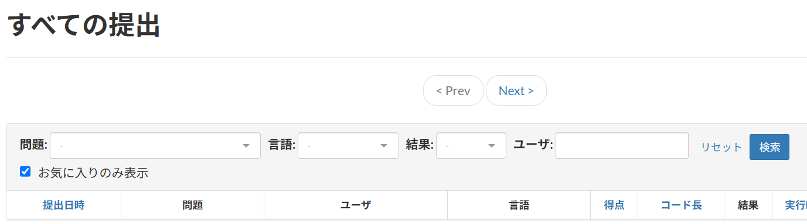

# AtCoderSubmissionFilters
AtCoderの「すべての提出」でフィルタを適用するユーザースクリプト。
* AtCoderFavSubmissionFilter（お気に入りフィルタ）  
* 同じページで動作する他のスクリプトが今後追加される可能性あり

## AtCoderFavSubmissionFilter
* ファイル: `filter-by-fav.user.js`

### 機能
* AtCoderコンテストページの「すべての提出」において、「お気に入り」に登録済みのユーザのみ表示させ、他のユーザの提出を非表示にする。
* 表示/非表示は、チェックボックスで切り替え可能である。
* 注意点: 適用されるのは現在開いているページのみであり、他ページに跨る過去の提出までは表示されない（お気に入り登録済みの少人数の仲間内で短時間のバチャコンを開催した直後などには有用）。ページ内の提出がすべて非表示になった場合、そのページにお気に入りユーザの提出がない。

### 表示例

## インストール
1. [Tampermonkey](https://www.tampermonkey.net/) または[Violentmonkey](https://violentmonkey.github.io/) をインストール
2. GreasyForkからインストール:
    * [AtCoderFavSubmissionFilter](https://greasyfork.org/ja/scripts/536911-atcoderfavsubmissionfilter)
